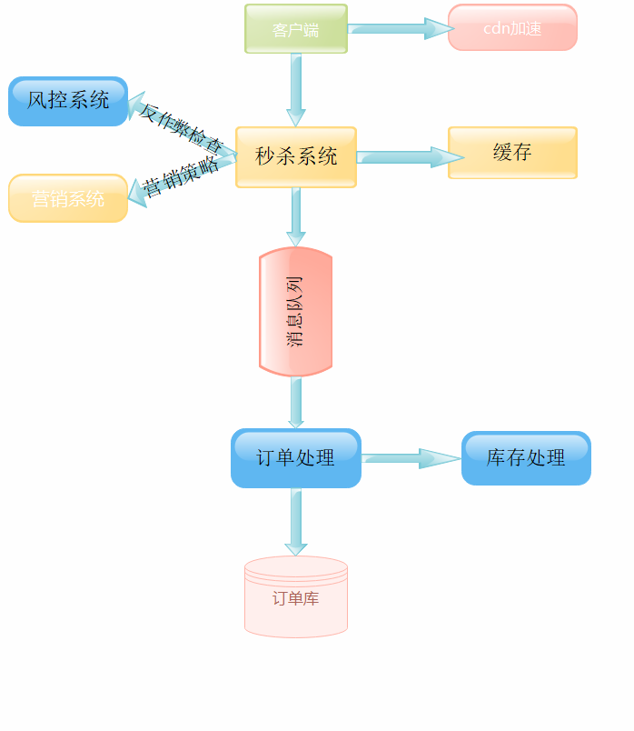

秒杀构架到如今是一个很常见的业务场景，多数情况要考虑到瞬时的流量峰值不至于压垮系统，但同时又要保证整个业务系统的可用性,许多大公司在面试的时候也会问到关于秒杀的问题。

秒杀场景的业务场景包括：

1. 价格比较优惠
2. 推广效果比较好
3. 在短时间内顺时将商品售空

技术需求分析重点考虑以下几点：

1. 关于商品的超买超卖的问题
2. 订单持久化，高并发情况下数据写入的一致性问题
3. 如果在高并发的情况下解决系统负载问题
4. 针对秒杀这种场景，其实多数流量是无效的，如果能够把无效的流量挡住就可以有效的解决后端数据库写入的压力

现在将秒杀作为一个单独的业务进行分析：

关系型数据库设计：

- 为了保证整个操作的原子性，由数据库来保证最后的秒杀结果

  1. 为了保证每个只能抢购一次，必需和用户表单进行关联，为了表达的简洁性，省略其它字段

     以下为用户表单结构：

     ```mysql
     CREATE TABLE user(
         `user_id` VARCHAR(35) PRIMARY KEY COMMENT '用户id',
         `user_name` VARCHAR(100) NOT NULL COMMENT '用户名'
     )engine =innodb,charset ='utf8';
     ```

  2. 对于商品的数量表单设计如下：

     将秒杀商品的基本信息放入一张单独的表中

     ```mysql
     CREATE TABLE kill_product
     (
         `request_id`     VARCHAR(64) PRIMARY KEY COMMENT 'request id',
         `kill_id`        BIGINT(64) AUTO_INCREMENT COMMENT '秒杀id',
         `product_id`     BIGINT(64)    NOT NULL COMMENT '商品id',
         `product_name`   VARCHAR(60)   NOT NULL COMMENT '商品名称',
         `product_price`  DECIMAL(8, 2) NOT NULL COMMENT '商品价格',
         `product_number` INT           NOT NULL COMMENT '商品数量',
         `start_time`     TIMESTAMP COMMENT '开始时间',
         `end_time`       TIMESTAMP COMMENT '结束时间',
         unique index `killid`(`kill_id`)
     ) engine = innodb,charset = 'utf8';
     ```

     

  3. 已经被抢购的商品将被插入订单表，订单表设计如下：

     ```mysql
     CREATE TABLE kill_oder_list(
         `oder_id` BIGINT(64) AUTO_INCREMENT PRIMARY KEY COMMENT '订单id',
         `user_id` VARCHAR(30) COMMENT '订单用户id',
         `product_id` BIGINT(64) NOT NULL COMMENT '订单商品id',
         `number` INT NOT NULL COMMENT '商品数量',
         `pay_status` BOOLEAN DEFAULT FALSE COMMENT '支付状态',
         `oder_date` DATE NOT NULL COMMENT '下单时间'
     )engine =innodb,charset ='utf8';
     ```

缓存设计：

- 为了保证数据的高频率读写，使用redis来做缓存处理，k-v存储结构设计

  ```
  └── kill
       └── killId
               ├── productId
       		├── productNumber
       		├── productPrice
       		├── productName
       		├── startTime
       		└── endTime
  ```

请求接口设计：

- 请求接口及参数设计

  1. 秒杀商品入库接口（后台管理接口） `/manage/killPrepare`

     ```json
     {
         "productName":string,
         "productPrice":double,
         "productNumber":int,
         "startTime":long,
         "endTime":long
     }
     ```

  2. 秒杀请求接口  `/kill/buy`

     ```json
     {
         "requestId":string,
         "killId":string,
         "userId":string,
         "productId":string
        
     }
     ```

     

  3. 获取库存接口 `/kill/query`

     ```json
     {
         "killId":string,
         "productId":string
     }
     ```

     

  4. 获取秒杀结果接口 `/kill/result`

     ```json
     {
         "userId":string,
         "productId":string,
         "killId":string
     }
     ```

​        

由于最终的数据一致性由关系型数据库保证，所以最终的秒杀结果也由数据库为准，将整个系统架构设计如下：



后端配合spring cloud技术架构 

